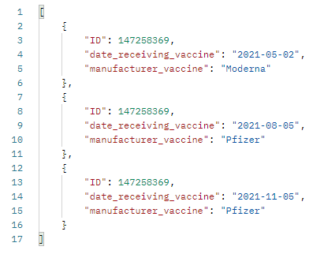

# HomeExercise_HadsimAtida_OriyanGoren
Author: Oriyan Goren | ID: 213022288 | Email: oriyango@edu.hac.ac.il
(Remark: I deleted the directory "node_modules". you should need to run 'npm install').

# Part A
I created a node.js project and wrote the server side in JS, I did not write the client side because what was written in the instructions was to write only the server side and connecting to a database.
I connected to the php Admin database, where I created the 3 tables and accessed them with GET and POST operations. I did part of the bonus it is on the server side page.

Some of the links I ran in Postman to insert data into the tables - POST and Screenshots of the tables in php-Admin after I did the POST operation:

addPatient:
1. http://localhost:3000/addPatient/?id=123456789&first_name=Yosi&last_name=Levi&city=Tel-Aviv&street=Arlozorov&house_number=100&date_birth=1980-10-10&phone=046541234&mobile_phone=0527946258
2. http://localhost:3000/addPatient/?id=147258369&first_name=Assaf&last_name=Cohen&city=Jerusalem&street=King-George&house_number=20&date_birth=1990-06-06&phone=026541245&mobile_phone=0546389741

table - personal_details:

addVaccination:
1. http://localhost:3000/addVaccination/?id=123456789&date_receiving_vaccine=2021-05-01&manufacturer_vaccine=Moderna
2. http://localhost:3000/addVaccination/?id=147258369&date_receiving_vaccine=2021-05-02&manufacturer_vaccine=Moderna

table - vaccine_details:

addDates:
1. http://localhost:3000/addDates/?id=123456789&positive_result_date=2021-02-01&recovery_date=2021-02-08
2. http://localhost:3000/addDates/?id=147258369&positive_result_date=2021-02-03&recovery_date=2021-02-10

table - dates_sick_recovery:

Some of the links I ran in Postman to get data from the tables - GET and Screenshots of the results of GET from Postman:

getPatient:
1. http://localhost:3000/getPatient/?id=123456789
2. http://localhost:3000/getPatient/?id=147258369

getVaccination:
1. http://localhost:3000/getVaccination/?id=123456789
2. http://localhost:3000/getVaccination/?id=147258369

getDates:
1. http://localhost:3000/getDates/?id=123456789
2. http://localhost:3000/getDates/?id=147258369

getAllPatientDetails:
1. http://localhost:3000/getAllPatientDetails/?id=123456789
2. http://localhost:3000/getAllPatientDetails/?id=147258369

getActivePatientsLastMonth - Bonus:
1. http://localhost:3000/getActivePatientsLastMonth/?currentMonth=May
2. http://localhost:3000/getActivePatientsLastMonth/?currentMonth=June

getCopaMembersNotVaccinated - Bonus:
1. http://localhost:3000/getCopaMembersNotVaccinated/
2. http://localhost:3000/getCopaMembersNotVaccinated/

# Part B
I wrote the second part of the homework here in a folder named: "Part B", inside it there are 2 txt files of the two sections.

Section 1 - In this section I will review the system and offer solutions.

Section 2 - In this section I will write tests that can crash the system.
